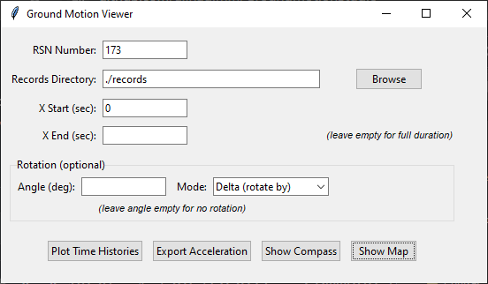
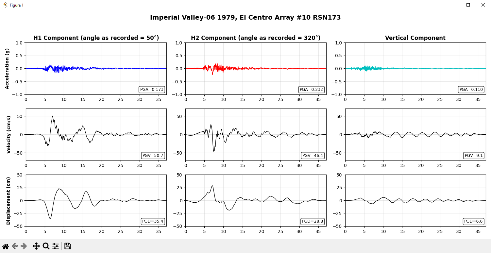
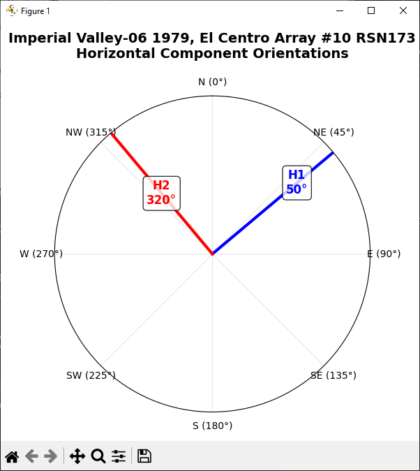
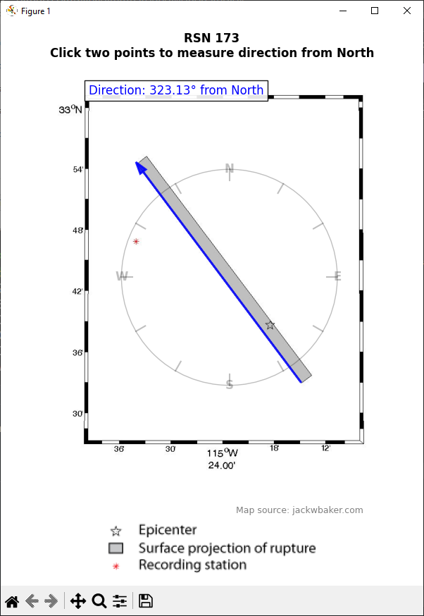

# GroundMotionStudio

A Python toolkit for visualizing, analyzing, and manipulating ground motion records from the PEER NGA Database.

## 🚀 Quick Start

### Download Standalone Executable (Windows)
**No Python installation required!**

📥 **[Download GroundMotionStudio.exe](https://github.com/alinadimm/GroundMotionStudio/raw/master/GroundMotionStudio.exe)**

Simply download and run the executable - all dependencies are included.

---

## Screenshots

### Main Interface

*Simple and intuitive interface for loading and analyzing ground motion records*

### Time History Plots

*Acceleration, velocity, and displacement plots with rotation support*

### Component Compass

*Visualize original and rotated component orientations*

### Station Map

*Interactive map with fault locations and manual angle measurement tool*

---
## Features

### 📊 Time History Visualization
- Plot acceleration, velocity, and displacement time histories
- Support for all three components (H1, H2, Vertical)
- Customizable time windows
- High-quality export to PNG

### 🔄 Component Rotation
- Rotate horizontal components to any orientation
- Two rotation modes:
  - **Delta mode**: Rotate by a specified angle
  - **Target mode**: Rotate H1 to a target orientation
- Visualize both original (pale) and rotated (bold) components
- Automatic handling of different array lengths through zero-padding

### 🧭 Orientation Tools
- Interactive compass visualization showing component orientations
- RSN station map display with interactive angle measurement
- Automatic extraction of component angles from filenames

### 💾 Data Export
- Export acceleration data to text files
- Support for time-windowed data extraction
- Automatic documentation of rotation parameters
- Organized output with metadata headers

### 🖥️ User-Friendly GUI
- Intuitive Tkinter-based interface
- Browse and select record directories
- Real-time parameter adjustment
- Error handling and user feedback

## Installation

### Prerequisites
- Python 3.7 or higher
- pip package manager

### Station Maps
- **Station location maps** are retrieved from [Jack W. Baker's website](https://www.jackwbaker.com/pulse_classification_v2/Maps/)
- Maps are © Jack W. Baker and are fetched dynamically when using the "Show Map" feature
- Map legend and fault information are included in the visualization
- **Attribution is automatically displayed** on map plots as "Map source: jackwbaker.com"

### Usage of Maps
When publishing results that include maps from this tool, please acknowledge:
> Station maps courtesy of Jack W. Baker (https://www.jackwbaker.com)
s
### Dependencies
- **numpy**: Numerical computations and array operations
- **matplotlib**: Plotting and visualization
- **tkinter**: GUI framework (included with Python)
- **requests**: HTTP requests for map data
- **PIL (Pillow)**: Image processing

### Supported Data
- PEER NGA Database AT2 format
- Acceleration in units of g
- Time step must be consistent within each file